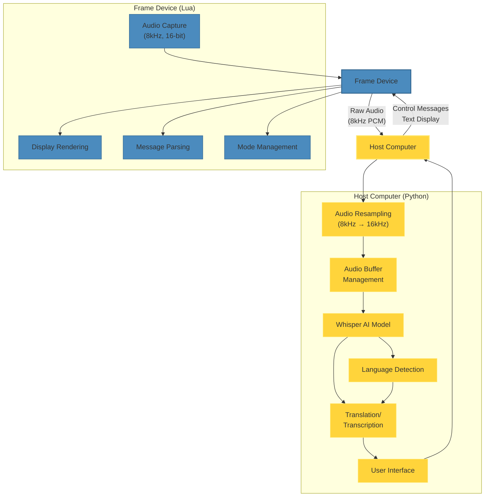

# FramePolyglot

<p align="center">
  <strong>Advanced real-time speech translation and transcription system for Frame devices</strong>
</p>

<p align="center">
  <a href="#features">Features</a> •
  <a href="#architecture">Architecture</a> •
  <a href="#installation">Installation</a> •
  <a href="#usage">Usage</a> •
  <a href="#technical-details">Technical Details</a> •
  <a href="#roadmap">Roadmap</a>
</p>

## Overview

FramePolyglot is a sophisticated speech processing system that transforms Frame devices into powerful translation and transcription tools. By integrating OpenAI's Whisper model with Frame's hardware capabilities, FramePolyglot enables real-time speech recognition and translation across multiple languages with exceptional accuracy.

The system employs a hybrid architecture that combines the efficiency of Lua for device-side operations with the computational power of Python for AI processing, creating a seamless experience for users requiring multilingual communication tools.

## Features

- **Real-time Speech Processing**: Capture and process speech with minimal latency
- **Dual-mode Operation**: Switch between translation and transcription modes
- **Automatic Language Detection**: Identify source language with high confidence
- **Optimized Audio Processing**: Specialized audio resampling and buffering for Frame hardware
- **Elegant Display Interface**: Clean, readable text presentation on Frame's display
- **Asynchronous Architecture**: Non-blocking design for responsive user experience
- **Robust Error Handling**: Graceful recovery from connection and processing issues
- **Resource-efficient Implementation**: Optimized for Frame's hardware constraints

## Hardware

This project is specifically designed for the **Frame** device by Brilliant Labs.

<p align="center">
  
</p>

Frame is a pair of AI-enabled smart glasses designed for developers and hackers. It features:

- Built-in microphone for audio capture
- Display capabilities for showing text and graphics
- Bluetooth connectivity for communication with host devices
- Programmable with Lua for custom applications
- Sensors including IMU, camera, and more

You can learn more about Frame and purchase the device at [brilliant.xyz/products/frame](https://brilliant.xyz/products/frame).


## Demo
Demo
<p align="center">   <iframe
src="https://www.youtube.com/shorts/NCxZcATHQD8" 
frameborder="0" 
allow="accelerometer; autoplay; encrypted-media; gyroscope; picture-in-picture" 
allowfullscreen></iframe> </p>

## Architecture

The system architecture employs a bidirectional communication flow between the Frame device and the host computer, with specialized components handling different aspects of the processing pipeline:



## Installation

### Prerequisites

- Python 3.8+
- Frame device with firmware v0.5+
- Frame SDK and libraries


### Setup

1. Clone the repository:

```shellscript
git clone https://github.com/yourusername/FramePolyglot.git
cd FramePolyglot
```


2. Install dependencies:

```shellscript
pip install -r requirements.txt
```


3. Download the Whisper model (happens automatically on first run, but can be pre-downloaded):

```shellscript
python -c "from faster_whisper import WhisperModel; WhisperModel('base', device='cpu')"
```


## Usage

1. Connect your Frame device via Bluetooth
2. Run the application:

```shellscript
python frame_translation.py
```


3. Use the menu to select your desired operation:

1. Option 1: Start recording
2. Option 2: Toggle between translation and transcription modes
3. Option 3: Exit


4. When recording, speak clearly into the Frame's microphone

1. Press Enter to stop recording
2. View results on the Frame's display


## Technical Details

### Audio Processing Pipeline

The system implements a sophisticated audio processing pipeline:

1. **Capture**: Raw audio is captured at 8kHz/16-bit from the Frame's microphone
2. **Buffering**: Audio is accumulated in a rolling buffer (configurable duration)
3. **Resampling**: Audio is resampled from 8kHz to 16kHz for Whisper compatibility
4. **Normalization**: PCM values are normalized to the [-1.0, 1.0] range
5. **Processing**: The Whisper model processes audio in configurable intervals
6. **Language Detection**: Source language is identified with confidence scoring
7. **Translation/Transcription**: Based on selected mode, text is generated


### Whisper Model Configuration

The system uses the following Whisper configuration:

- Model size: Base (can be configured to tiny/small/medium/large)
- Compute type: INT8 quantization for efficiency
- Beam size: 5 (for improved accuracy)
- VAD filter: Enabled (to filter non-speech segments)


### Frame Integration

The custom Lua application handles:

- Audio capture and streaming
- Display rendering with text wrapping
- Message parsing for bidirectional communication
- Mode switching between translation and transcription


### Code Explanation

The system consists of two main components:

#### 1. Python Host Application

The Python application handles the AI processing and communication with the Frame:

```python
import asyncio
import time
import numpy as np
import resampy
from frame_msg import FrameMsg, RxAudio, TxCode
from faster_whisper import WhisperModel

# Configuration
MODEL_SIZE  = "base"     # tiny / base / small …
STEP_SEC    = 1.0        # seconds between partial decodes
RATE_IN     = 8000       # Frame mic
RATE_OUT    = 16000      # Whisper expects
CONTEXT_SEC = 25         # rolling window on which we run Whisper
```

Key components:

- **Audio Conversion**: Converts PCM16 to float32 for processing

```python
def pcm16_to_f32(pcm: bytes) -> np.ndarray:
    return np.frombuffer(pcm, dtype=np.int16).astype(np.float32) / 32768.0
```


- **Whisper Integration**: Processes audio with the Whisper model

```python
segments, info = model.transcribe(
    buf_pcm16k,
    task="translate" if translation_mode else "transcribe",
    beam_size=5,
    vad_filter=True,
    word_timestamps=False,
)
```


- **Asynchronous Processing**: Uses asyncio for non-blocking operations

```python
stop_event = asyncio.Event()
stop_task = asyncio.create_task(wait_for_stop(stop_event))
```


#### 2. Lua Frame Application

The Lua application runs on the Frame device and handles audio capture and display:

```lua
local data = require('data.min')
local code = require('code.min')
local audio = require('audio.min')

-- Message codes
local AUDIO_CONTROL_MSG = 0x30
local TEXT_UPDATE_MSG = 0x31
local MODE_UPDATE_MSG = 0x32
```

Key components:

- **Message Parsing**: Handles different types of messages

```lua
data.parsers[TEXT_UPDATE_MSG] = function(bytes)
    local str = string.sub(bytes, 1)
    return {text = str}
end
```


- **Display Rendering**: Formats and displays text on the Frame

```lua
-- Split text into lines (simple approach)
local y = 170
local start = 1
local line_length = 40

while start &lt;= #text do
    local display_text = string.sub(text, start, start + line_length - 1)
    frame.display.text(display_text, 10, y)
    y = y + 40
    start = start + line_length
    
    -- Prevent too many lines
    if y > 330 then break end
end
```


- **Audio Capture**: Manages audio recording and streaming

```lua
if data.app_data[AUDIO_CONTROL_MSG].value == 1 then
    -- Start audio
    streaming = true
    audio.start({sample_rate=8000, bit_depth=16})
    frame.display.text("Recording...", 10, 130)
    frame.display.show()
else
    -- Stop audio
    audio.stop()
    frame.display.text("Processing...", 10, 130)
    frame.display.show()
end
```


## Roadmap

- Add support for saving translations to file with timestamps
- Implement voice activity detection for more efficient processing
- Add support for translation to languages other than English
- Create a web interface for remote control and monitoring
- Implement offline mode with compressed models
- Add support for specialized domain vocabularies


## Contributing

Contributions are welcome! Please feel free to submit a Pull Request.

## License

This project is licensed under the MIT License - see the LICENSE file for details.

## Acknowledgments

- OpenAI for the Whisper speech recognition model
- The Frame team for their hardware and SDK
- The faster-whisper team for their optimized implementation
